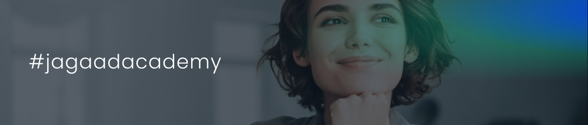

<h4 align="center"> <a href="#">Documentation</a>  <a href="#">FAQs</a>  <a href="#">Community</a> <a href="#">Privacy policy</a> </h4>
<h3 align="center">Start your tech career with Jagaad Academy!</h3>
<h4 align="center"><a href="https://academy.jagaad.com/course/php-backend-development/">Become a developer in 24 weeks with in a fully remote academy.</a></h4>
<h3 align="center">Follow us on: <a href="https://www.instagram.com/academyjagaad/">Instagram</a> | <a href="https://www.facebook.com/JagaadAcademy">Facebook</a> | <a href="https://www.linkedin.com/school/jagaad-academy/">Linkedin</a></h3>

# Summary

Our mission is to cultivate a diverse community of companies and IT talents, offering comprehensive software development courses and tailored B2B programs to enhance corporate team skills in the IT industry. 

By joining our courses, you'll gain expertise in building dynamic web applications using HTML, CSS, TypeScript, and more. Our curriculum covers the most in-demand technologies, empowering you to choose the right tools for any project you encounter. 

# What will you learn in the FE course with Jagaad Academy?

-  Expand your skills: Our courses not only focus on tech stacks but also develop your teamwork, problem-solving, leadership, and other essential skills.
-  Global community: With a team of 50+ developers worldwide, you'll have the opportunity to collaborate with professionals from diverse backgrounds.
-  Study now, pay later: We offer a "study now, pay later" format, allowing you to pay for the course after 2 months from your graduation.
-  Our HR assistance will support you in finding job opportunities and also help you develop soft skills and prepare effective CVs.
-  If we still need to include any details here: please go to our frequently asked questions and get all the answers to your questions.

Moreover, you can also explore our free courses to kickstart your learning journey.

# What will you learn in the FE course with Jagaad Academy?

Jagaad Academy's comprehensive Front-End (FE) curriculum includes the following topics: 

-   Introduction to Algorithms
-   Basics of Unix/Bash
-   CSS and SASS
-   HTML
-   Advanced JavaScript
-   Debugging techniques
-   Responsive web design
-   Visual guidelines and code markup
-   Version control with GIT
-   Advanced JavaScript concepts
-   Code optimization strategies
-   Consuming APIs
-   React & Redux Toolkit
-   TypeScript
-   Next.js
-   Docker
-   Storybook

# Become a coach

Are you a seasoned professional interested in sharing your knowledge? Join us as a coach and get paid to create full-length Scrimba courses. We're looking for experienced individuals who have a taste for adventure and a passion for teaching bright minds. 

## Prerequisites to become a coach

-   More than 5+ years of experience in a given topic
-   Zeal to help and make things easier for the students and guide them along the process

# Contact us

Fill out the form on our website or send us a direct message to express your interest and area of expertise.

To get in touch with us, reach out directly on [LinkedIn](https://www.linkedin.com/school/jagaad-academy/) or on [Facebook](https://www.facebook.com/JagaadAcademy). We also offer a convenient live chat option on our website through Facebook Messenger.

Also if you want to contact us directly, you can write to us at: 
[academy@jagaad.com](mailto:academy@jagaad.com)

# Privacy policy

For more information and to review our privacy policy, please visit our website:  
[https://academy.jagaad.com/privacy/](https://academy.jagaad.com/privacy/)

# Community

The development. It's for those who want a proper, well-rounded grounding in concepts fundamental to all computing disciplines, and for those who have the discipline, will, and (most importantly!) good habits to obtain this education largely on their own, but with support from a worldwide community of fellow learners.

**[Instagram](https://www.instagram.com/academyjagaad/) / [Facebook](https://www.facebook.com/JagaadAcademy) / [Linkedin](https://www.linkedin.com/school/jagaad-academy/)**

# Frequently Asked Questions - [All FAQs](https://academy.jagaad.com/faq/)

Here you can find some of the most asked questions, however for a full list of questions please access our website.

## Do you have free courses that I can access?

Our free courses are totally free, and they don’t require you to enroll in our full-time course. You can follow them whenever you prefer! Please access here: [https://academy.jagaad.com/free-courses/](https://academy.jagaad.com/free-courses/)

## How much do the courses cost?

We teach our courses through a “study now, pay later” format. You will only need to pay for course once you find a job in the IT industry. And within 18 months from your graduation date, you will receive our assistance in helping you find a job.

-   6 months courses cost €3000
-   We offer the possibility to pay monthly fees of €149.50 euro for 20 months
-   You can also pay everything in one installment

## Will I be supported in looking for a new job after the course?

Of course!During the course you will have a dedicated module were will assist you in interview preparation, LinkedIn profile optimization and CV creation. You will just need to follow these steps when applying for a job.After graduation, the best performers will be invited to work for Jagaad. We will also contact graduates with our IT partner companies who are willing to hire new profiles.

